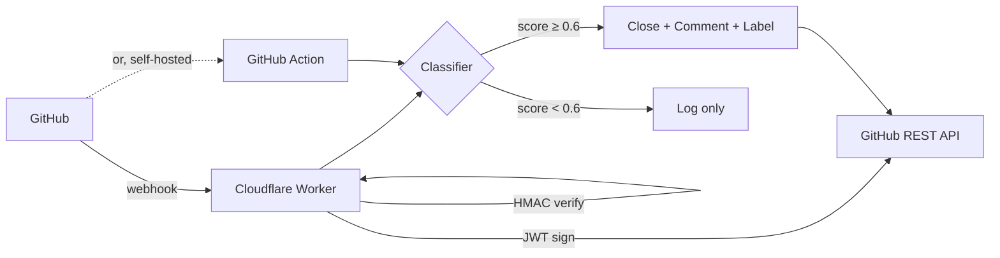

<div align="center">

# RepoShield

**Block AI-slop PRs, crypto-airdrop spam, and drive-by farming accounts on your GitHub repo — automatically.**

[](https://github.com/Ax1zz/reposhield/actions/workflows/ci.yml)
[](LICENSE)
[](https://workers.cloudflare.com/)
[](action/)
[](https://www.typescriptlang.org/)

</div>

---

The 2026 AI-bot wave (templated LLM-slop PRs, crypto airdrop spam, fake-contributor PRs farming for token drops) is drowning open-source maintainers. `awesome-mcp-servers` got **2000+ bot PRs in 12 months**. `wong2/awesome-mcp-servers` had to close PRs entirely. GitHub hasn't shipped throttling in 2 years.

RepoShield closes the gap with two deployment surfaces sharing one classifier:

- **Free GitHub Action** — drop a 10-line workflow into any repo. No external services.
- **Hosted GitHub App** — repo-wide, no workflow file, runs on Cloudflare Workers.

## What it blocks

| Category | Examples |
|---|---|
| **Crypto-airdrop spam** | `$CLAW airdrop is live`, `connect your wallet`, wallet addresses (`0x…`, `bc1…`, `T…`), `t.me/joinchat_…`, `discord.gg/…`, URL shorteners as the only links, GitHub-impersonating typosquats (`github-claim.io`) |
| **AI-templated PRs / issues** | `"I have analyzed the codebase"`, `"This pull request aims to improve the project"`, `"I'd be happy to help"`, `"As a large language model…"`, emoji-density spikes, em-dash overuse |
| **Drive-by farming** | Accounts <7 days old, zero prior contributions, zero followers, default avatar — but only when stacked on top of another signal, never alone |
| **Templated typo PRs** | `docs: fix typo`, `update README`, `improvements`, one-line PRs to `awesome-*` lists from no-history accounts |

It does **not** block on drive-by signals alone — a fresh-account first-time bug reporter pasting a stack trace stays open. See [classifier.ts](app/src/classifier.ts) for the full scoring model and [classifier.test.ts](app/src/classifier.test.ts) for the test matrix.

## Why it (mostly) won't false-positive your real bug reports

A real bug report leaves fingerprints a spammer almost never bothers to paste. The classifier *rescues* a submission when it sees:

- Fenced code block (`` ``` ``)
- Stack trace (`at Foo.bar (src/foo.ts:42:18)`, `File "x.py", line 12`, `panic:`, `goroutine 7 [`)
- File reference with line number (`src/range.ts:88`, `foo.js#L42`)
- A cited version (`v1.2.3`, `node 20.x`)
- Cross-reference to another issue (`#128`)

These contribute *negative* score and pull borderline cases back to safe. The negative cap is tightened when the primary category is `crypto_airdrop`, so a spammer can't escape by pasting a random code block.

## Architecture



Two surfaces, one classifier:

| Surface | What runs it | When you'd choose it |
|---|---|---|
| `action/` | Your repo's runner, on every `issues.opened` / `pull_request_target.opened` | Self-host, zero third-party services, full ownership |
| `app/` | Cloudflare Worker, App-installed | One install, repo-wide, no workflow file, faster (no runner cold start) |

## Quick start — GitHub Action (free, 30 seconds)

Create `.github/workflows/reposhield.yml`:

```yaml
name: RepoShield
on:
  issues:
    types: [opened]
  pull_request_target:
    types: [opened]

permissions:
  issues: write
  pull-requests: write

jobs:
  shield:
    runs-on: ubuntu-latest
    steps:
      - uses: Ax1zz/reposhield/action@v0.1.0
        with:
          block-threshold: '0.6'   # raise for fewer false positives
          dry-run: 'false'         # 'true' = comment verdict only, don't close
```

Use `pull_request_target` (not `pull_request`) so the workflow has write access to PRs from forks. RepoShield only reads metadata; it never checks out untrusted code.

## Self-host the App (Cloudflare Worker)

Five-minute setup checklist: [SETUP.md](SETUP.md).

TL;DR:
1. Register a GitHub App, copy App ID + download the private key (.pem).
2. `cd app && npm install && npx wrangler deploy` → get your Worker URL.
3. `npx wrangler secret put GITHUB_APP_ID / GITHUB_APP_PRIVATE_KEY / GITHUB_WEBHOOK_SECRET`.
4. Point the App's webhook to `https://<your-worker>.workers.dev/webhook`.
5. Install the App on your repos.

## Tuning

| Knob | Where | Effect |
|---|---|---|
| `block-threshold` | Action input / Worker constant | Raise (0.7+) → fewer false positives, miss more spam |
| `dry-run` | Action input | Comment verdict but don't close — good for an audit week before going live |
| Negative-signal cap | `classifier.ts` | Lower (< 0.4) → harder to escape verdict by padding with code blocks |
| Pattern lists | `classifier.ts` (`CRYPTO_SPAM_PATTERNS`, `LLM_SLOP_PHRASES`, etc.) | Add your repo-specific spam wording |

## Local development

```bash
cd app
npm install
npm test           # vitest run — 14 classifier tests
npm run typecheck  # tsc --noEmit
npx wrangler dev   # local Worker on http://localhost:8787
```

The action shares the classifier with the Worker (`action/src/index.ts` imports `../../app/src/classifier`), so any change to scoring rules is testable in one place.

## Roadmap

- [x] Day 1 — rule-based classifier, Worker webhook, GitHub Action, 14 tests
- [x] Day 1 — negative signals (code block, stack trace, file:line) to rescue real bug reports
- [ ] v0.2 — extended slop corpus, emoji/em-dash heuristics tuned per repo
- [ ] v0.3 — maintainer override → reopen + add author to per-repo allowlist
- [ ] v0.4 — embedding similarity vs curated slop corpus (Cloudflare Workers AI)
- [ ] v0.5 — minimal dashboard: blocked-event log, override stats

## License

[MIT](LICENSE). Use freely, fork freely, no warranty.

## Acknowledgements

Inspiration for the drive-by pattern set came from observing closed-PR streams on `wong2/awesome-mcp-servers`, `punkpeye/awesome-mcp-servers`, and threads on GitHub Community Discussions ([#174283](https://github.com/orgs/community/discussions/174283), [#107248](https://github.com/orgs/community/discussions/107248)).
